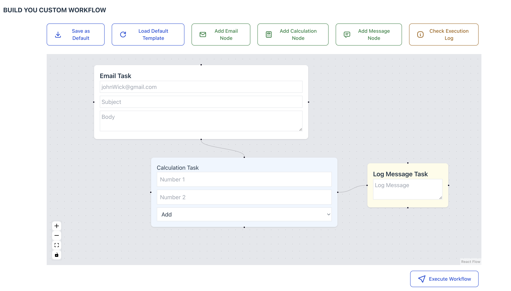
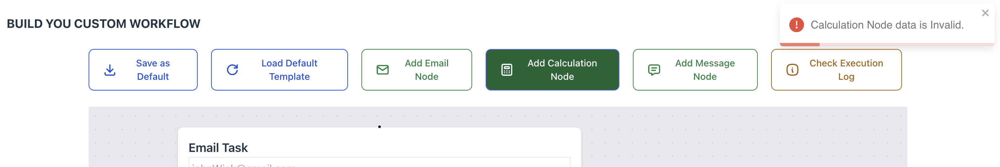

# No Code Tool Builder

This application is creating no-code workflow and execution for the Frontend Side using React, Zustand and Typescript.

## System Requirements

These are the System Requirements to run this project.

```js
{
  "react": "^18.3.1",
  "typescript": "~5.6.2",
  "node": ">=18.0.0",
  "npm": ">=9.0.0"
}
```

## Installation and Run in Local Environment.

- If you installed NPM.

```js
npm ci
npm run dev
```

- If you installed Yarn.

```js
yarn install
yarn dev
```

## Unit Testing

- If you want to run the testcases.

```js
npm run test || yarn test
```

## Key Architecture

- You can create multiple Email, Calculation and Message Tasks in a workflow.
  
- You can also check both failed and success execution logs.
- Can store 1 default workflow and load whenever you need.
- Used Zustand Global State management to store default workflow and execution logs.
- Integrated with toast to improve UX and simple validation for calculation task.
  
